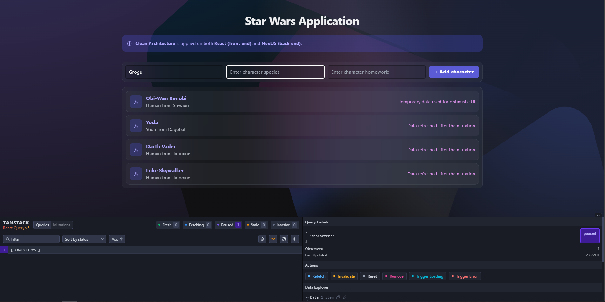
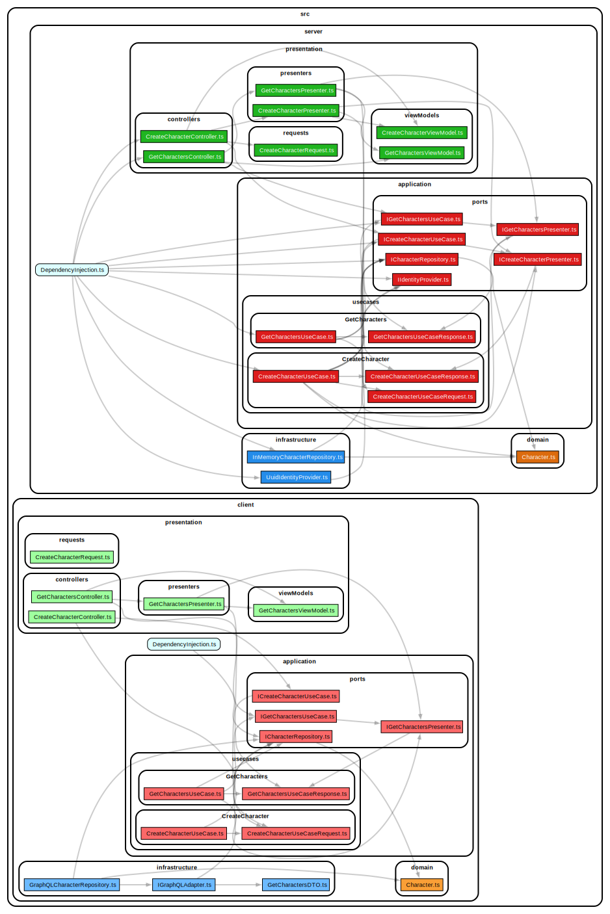

# (WIP) Front & Back Clean Architecture NextJS example
## The application

This is a simple example of a fullstack application using NextJS. The application is respecting the Clean Architecture principles for both front-End and back-end.

## Dependencies

Dependency injection is done in both front-end and back-end using the same package: `@evyweb/ioctopus`: https://github.com/Evyweb/ioctopus

Here is the interactive dependency graph for the application: https://star-wars-app-steel.vercel.app/

